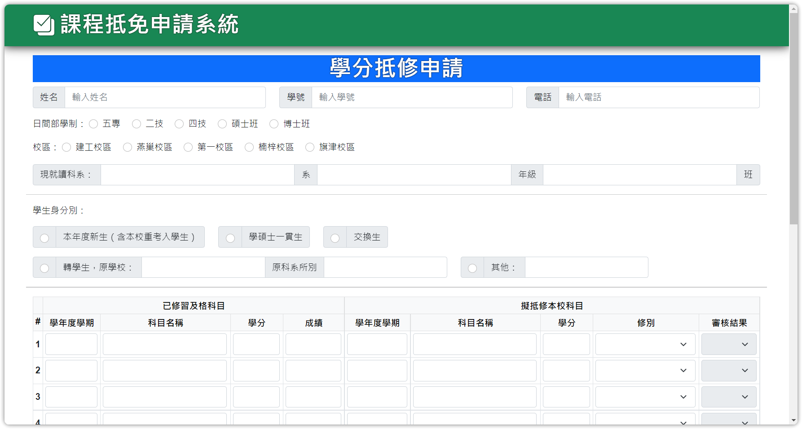

# 學生學程查詢系統



## Overview

課程抵免申請系統提供系上需要抵免成績的學生完成相關的抵免作業。

## Docker (Production)

### Configuration

- 配置環境變數，編輯檔案 `./docker/config.env`。

    ```text
    mysql_user=<db-user>
    mysql_password=<db-password>
    mysql_host=<db-host>
    SECRET_KEY=<secret-key>
    MYSQL_ROOT_PASSWORD=<db-password>
    ```

  - db-user : 資料庫的帳號
  - db-password : 資料庫的密碼
  - db-host : 資料庫的地址
  - secret-key : flask session 的金鑰

- 配置 SSL 證書在 Nginx Server，編輯資料夾 `./docker/nginx/` 中的 `certificate.crt` 與 `private.key`。

- 修改 Flask Server 為 Production 模式，編輯 `./main.py`。

    ```python
    # mode = 'development'
    mode = 'production'
    ```

### Startup

使用 Docker 建立容器啟動系統。

```bash
docker-compose up -d
```

預設將啟動以下連接埠 :

- `20010` : HTTP ( 將自動跳轉到 HTTPS )
- `20011` : HTTPS

## Project Structure

- `main.py` : 主要程式進入點。

- `config.py` : 相關配置參數檔案。
